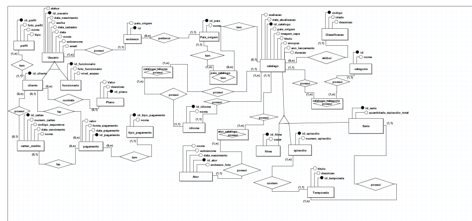
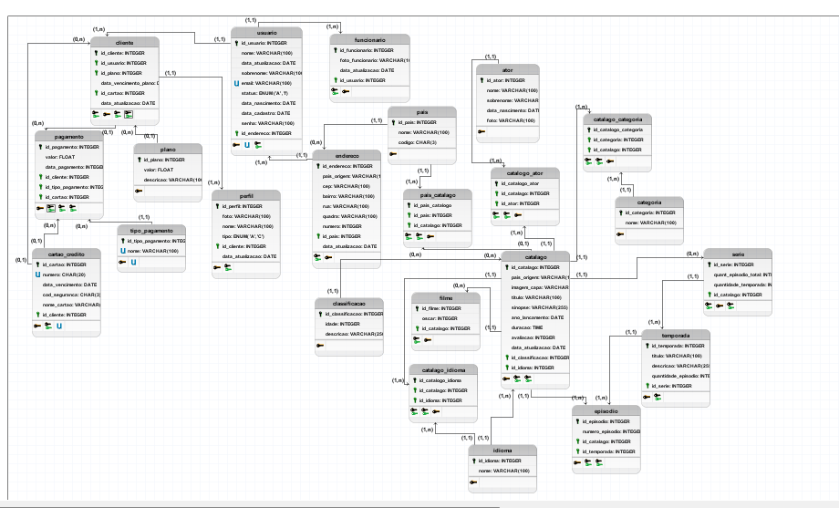

# Projeto Banco de dados

Este projeto tem intuito de demonstrar o conteúdo aprendido durante o curso de **DBA**, para isto foi escolhido um banco de dados para plataformas de streaming.

## Modelo Conceitual

## Modelo Logico

## Tabelas

- Tb_ator 
- Tb_cartao_credito
- Tb_catalogo
- Tb_catalogo_ator
- Tb_catalogo_categoria
- Tb_catalogo_idioma
- Tb_categoria
- Tb_classificacao
- Tb_cliente
- Tb_endereco
- Tb_episodio
- Tb_filme  
- Tb_funcionario
- Tb_idioma
- Tb_pagamento
- Tb_pais
- Tb_Pais_catalogo
- Tb_perfil
- Tb_Plano
- Tb_serie
- Tb_temporada
- Tb_tipo_pagamento
- Tb_usuario

 

## Views

- **Vw_Usuário:** Esta view mostra todos os dados de todos os usuários, deseja-se também saber, quais deles são funcionários e quais são clientes, o endereço de cada um e seu país de origem e quantos perfis cada um tem e qual é o seu plano.

- **Vw_catalogo:** Esta view mostra todos os dados da tabela catalogo identificando séries e filmes (não estando presentes os episódios nesta view), o idioma original e quantos idiomas estão disponíveis, a classificação indicativa e suas categorias.

- **Vw_episodio:** Esta visualização contém todos os dados dos episódios, qual sua série, e de qual temporada ele é.
- **Vw_temporada:** mostra os dados de forma organizada das temporadas.
- **Vw_ator:** Mostra de forma organizada os dados dos atores.
- **Vw_pagamento:** Mostra os dados de pagamento de forma organizada.
- **Vw_perfil:** Mostra os dados dos perfis de forma organizada.

## Funções

- **Fn_valida_texto:** Esta função faz a validação de texto
- **Fn_minuscula2:** Esta função faz a conversão dos caracteres para minúsculo.
.

## Procedures

- **Procedure sp_insert_classificacao:** Esta procedure faz a inserção na tabela classificacao 
- **Procedure sp_update_classificacao:** Esta procedure faz update dos dados da tabela classificacao
- **Procedure sp_delete_classificacao:** Esta procedure faz o delete dos dados na tabela classificacao
- **Procedure sp_insert_categoria:** Esta procedure faz insert de dados na tabela categoria
- **Procedure sp_update_categoria:** Esta procedure faz update de dados na tabela categoria
- **Procedure sp_delete_categoria:** Esta procedure faz delete de dados na tabela categoria
- **Procedure sp_insert_idioma:** Esta procedure faz insert de dados na tabela idioma
- **Procedure sp_update_idioma:** Esta procedure faz update de dados na tabela idioma
- **Procedure sp_delete_idioma:** Esta procedure faz delete de dados na tabela idioma
- **Procedure sp_insert_tipo_pagamento:** Esta procedure faz insert de dados na tabela tipo_pagamento
- **Procedure sp_update_tipo_pagamento:** Esta procedure faz update de dados na tabela tipo_pagamento
- **Procedure sp_delete_tipo_pagamento:** Esta procedure faz delete de dados na tabela tipo_pagamento
- **Procedure sp_insert_pais:** Esta procedure faz insert de dados na tabela Pais
- **Procedure sp_update_pais:** Esta procedure faz update de dados na tabela Pais
- **Procedure sp_delete_pais:** Esta procedure faz delete de dados na tabela Pais
- **Procedure sp_insert_plano:** Esta procedure faz inserts de dados na tabela Plano
- **Procedure sp_update_plano:** Esta procedure faz update de dados na tabela Plano
- **Procedure sp_delete_plano:** Esta procedure faz delete de dados na tabela Plano
- **Procedure  sp_insert_ator:** Esta procedure faz inserts de dados na tabela Ator
- **Procedure sp_delete_ator:** Esta procedure faz delete de dados na tabela Ator
- **Procedure sp_update_ator:** Esta procedure faz update de dados na tabela Ator

## Scripts

|Scripts    |Clique aqui|
|-----------|-----------|
|DDL        |[Clique aqui](./Scripts/DDLprojetofinal.sql)|
|Dados      |[Clique aqui](./Scripts/DATAPROJETOFINAL.sql)|
|Views      |[Clique aqui](./Scripts/viewsPROJETOFINAL.sql)|
|Funções    |[Clique aqui](./Scripts/funcoesProjetofinal.sql)|
|Procedures |[Clique aqui](./Scripts/Procedures.sql)|
|Dumps      |[Clique aqui](./dumps/DumpFull.sql) , [Clique aqui](./dumps/DumpDATA.sql), [Clique aqui](./dumps/DumpStructure.sql)| 

## Contatos

    |   

